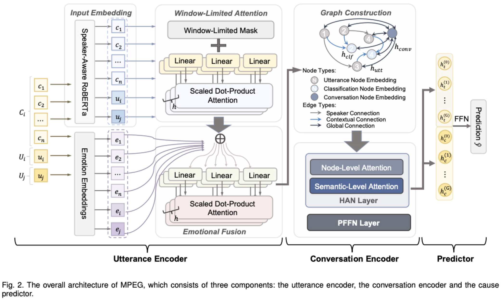

# MPEG: A Multi-Perspective Enhanced Graph Attention Network for Causal Emotion Entailment in Conversations

This repository contains the source code for our TAFFC 2023 paper:

T. Chen, Y. Shen, X. Chen, L. Zhang, and S. Zhao, "[MPEG: A Multi-Perspective Enhanced Graph Attention Network for Causal Emotion Entailment in Conversations](https://ieeexplore.ieee.org/abstract/document/10252019)," in IEEE Transactions on Affective Computing, doi:10.1109/TAFFC.2023.3315752.




Please cite our paper if you find our work helpful.

## Environment Settings

Our basic enviroment configuations are as follows:

- Operating System: Ubuntu 18.04
- CUDA: 10.1.105
- Python: 3.8.0
- PyTorch: 1.7.0
- DGL: 0.6.1


You can install the complete project configuations through the requirements file:

```
pip install -r requirements.txt
```

## Usage

You can execute our code through the following commands:

### RECCON-DD dataset

```
python run.py --data_name=RECCON --gradient_accumulation_steps=3 --learning_rate=3.6284e-06 --max_seq_length=512 --num_graph_attention=1 --seed=0 --num_train_epochs=10 --train_batch_size=12
```

### ConvCEPE dataset

```
python run.py --data_name=convCEPE --gradient_accumulation_steps=3 --learning_rate=3.6284e-06 --num_graph_attention=1 --seed=0 --num_train_epochs=10 --train_batch_size=12
```